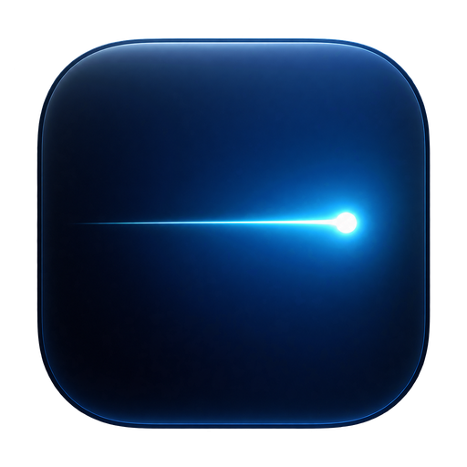

# Photon

<p align="center">
  
</p>

Photon is a stripped-down, macOS-only launcher. It opens instantly, stays out of the Dock, and covers the few things that actually get used: applications, clipboard history, notes, file search, and keybinds.

It is not an extension platform. There is no AI, no account, no cloud sync, and no telemetry.

## Features

- **Launcher** — `Cmd+Space` opens a compact floating search field that expands into results as you type. Down on the empty bar shows recommended apps and recents; turn on suggestions under **Settings > Appearance** to see them before typing. Configurable hotkey, panel width, and light/dark appearance.
- **Applications** — fuzzy search over `/Applications`, `/System/Applications`, `~/Applications`, and System Settings panes, ranked by frecency.
- **Clipboard history** — `Cmd+Shift+V`, or type `cb ` in the launcher. Text (with rich text), links, images, and files; searchable, pin, paste back or copy. Retention of 1/7/30 days or forever, an item limit, and excluded apps (password managers by default).
- **Notes** — a floating window with a collapsible sidebar of notes, live markdown styling, one `.md` file per note in `~/Library/Application Support/Photon/Notes`, and autosave. `⌘P` jumps to the sidebar. Type `notes` or `n <title>` in the launcher to open a note; an optional hotkey toggles the window.
- **File search** — type `/` or `f ` (or run *Search Files*) to search your home folder through Spotlight (`mdfind`). Enter opens, `Cmd+Enter` reveals in Finder, Space or `Cmd+Y` toggles Quick Look, `Cmd+C` copies the path, `Cmd+I` shows size and dates. Strong file matches also appear below applications in the main list.
- **Keybinds** — a Hyper key (Caps Lock held = `⌃⌥⇧⌘`, shown as `✦`; tap = nothing, Escape, or Caps Lock), shortcuts that launch, focus, or hide an app, and window management: halves, quarters, thirds, two-thirds, maximize, almost maximize, center, next/previous display, restore. Defaults: `✦←` `✦→` `✦↑` `✦↓` halves, `✦Return` maximize, `✦C` center, `✦[` / `✦]` displays. Every command is also searchable in the launcher.

## Install

```sh
brew tap ryanstoffel/taps
brew install --cask ryanstoffel/taps/photon
```

Homebrew 7 and later only load casks from third-party taps that you have trusted, unless you spell out the full name as above. Run `brew trust ryanstoffel/taps` once so that `brew upgrade` and the short name `photon` work too.

Or download `Photon-<version>.zip` or `.dmg` from the [latest release](https://github.com/RyanStoffel/photon/releases) and move `Photon.app` to `/Applications`. Requires macOS 14 or later; the binary is universal (Apple silicon and Intel).

Photon is distributed from [RyanStoffel/homebrew-taps](https://github.com/RyanStoffel/homebrew-taps). Current builds are ad-hoc signed and not notarized, so macOS Gatekeeper blocks the first launch of a downloaded copy:

- macOS 14: Control-click `Photon.app` and choose **Open**.
- macOS 15 and later: open Photon once, then go to **System Settings > Privacy & Security** and click **Open Anyway**.
- Or remove the quarantine flag: `xattr -dr com.apple.quarantine /Applications/Photon.app`

Releases are listed in [CHANGELOG.md](CHANGELOG.md). Version 0.1.0 is a pre-release: it passes CI, including a launch smoke test on a GitHub-hosted Mac, but has not yet been exercised on real hardware.

## Permissions

Photon is a menu-bar agent (`LSUIElement`). It does not appear in the Dock.

| Permission | When | Why |
| --- | --- | --- |
| none for the launcher itself | Phase 1 | `RegisterEventHotKey` does not require Input Monitoring. |
| Keyboard shortcuts | first launch | macOS Spotlight also defaults to `Cmd+Space`. Photon detects the conflict and tells you how to disable Spotlight's shortcut under **System Settings > Keyboard > Keyboard Shortcuts > Spotlight**. |
| Login Item | optional | "Launch at login" on the General settings tab uses `SMAppService`. |
| Accessibility | Clipboard (optional), Keybinds | Pasting a clipboard item into the frontmost app (Photon sends `Cmd+V`; without it, Return copies the item and shows a hint). Required for the Hyper key (a keyboard event tap) and window management (moving windows through the Accessibility API). Photon asks once on first launch and shows the status under **Settings > Keybinds**. Without it Caps Lock keeps its normal behaviour. |
| Input Monitoring | Keybinds (optional) | macOS may also list Photon here when the Hyper key is on. Accessibility alone is enough. |
| Full Disk Access | optional | File search only sees what Spotlight indexes; folders in Spotlight Privacy stay hidden. Photon adds its own excluded-folders list under **Settings > Files**. |

### How the Hyper key works

While the Hyper key is enabled and Accessibility is granted, Photon remaps the chosen key (Caps Lock by default) to F18 for the current login session using the same `hidutil` user key mapping Hyperkey-style apps use, then translates F18 into `⌃⌥⇧⌘` with an event tap. The mapping is removed when the Hyper key is turned off or Photon quits, and macOS clears it at logout anyway. **Settings > Keybinds > Reset Key Mapping** puts the key back by hand if anything goes wrong.

## Development

See [CONTRIBUTING.md](CONTRIBUTING.md) for the branching model, commit style, and PR flow.

```sh
git clone https://github.com/RyanStoffel/photon.git
cd photon
Scripts/package_app.sh
```

Architecture: [docs/architecture.md](docs/architecture.md). Releases: [docs/releasing.md](docs/releasing.md).

## License

[MIT](LICENSE)
